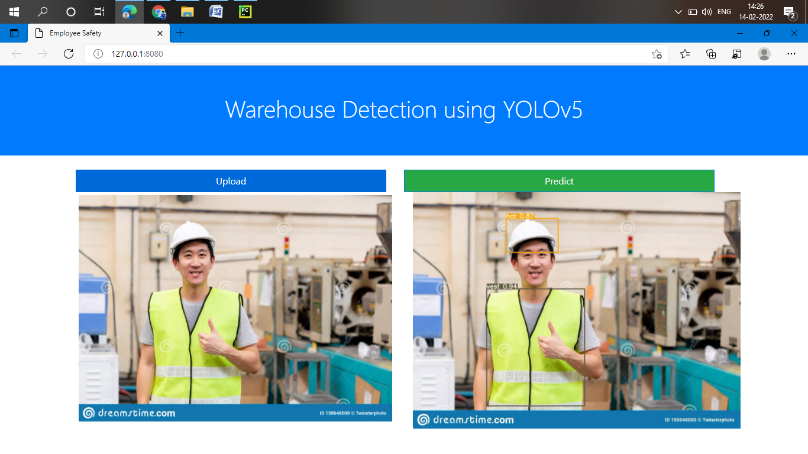

# PPE Detection using yolov5 For Empolyee

## Introduction
In Industry, specially manufacturing industry, Personal Protective Equipment (PPE) like helmet (hard-hat), safety-harness, goggles etc play a very important role in ensuring the safety of workers. However, many accidents still occur, due to the negligence of the workers as well as their supervisors. Supervisors can make mistakes due to the fact that such tasks are monotonous and they may not be able to monitor consistently. This project aims to utilize existing CCTV camera infrastructure to assist supervisors to monitor workers effectively by providing them with real time alerts.

## Functioning
* Input is taken from CCTV cameras
* YOLOV5 is used for detecting persons with proper PPE and those without PPE.
* An alert is raised if a person is found to be without proper PPE for more than some set duration, say 5 seconds

### Demo




## Dataset

The data used can be downloaded through this [link](https://public.roboflow.com/object-detection/hard-hat-workers) or can be downloaded from this repository as well (folders 'test' and 
'train'). .

## How to Use

To use this project on your system, follow these steps:

1.Clone this repository onto your system by typing the following command on your Command Prompt:

```
git clone https://github.com/srnsrn120/Factory_Employee_Safety.git
```
Now Go inside workspace:

```
cd Factory_Employee_Safety
```

2. Download all libaries using::
```
pip install -r requirements.txt
```

3. Run facemask.py by typing the following command on your Command Prompt:
```
python clientApp.py
```

#### The Project is now ready to use !!
